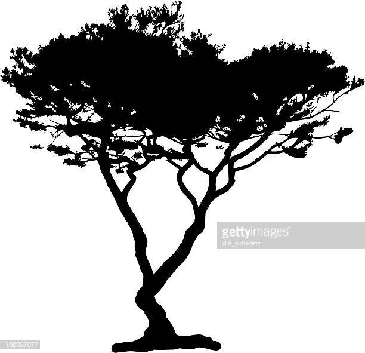
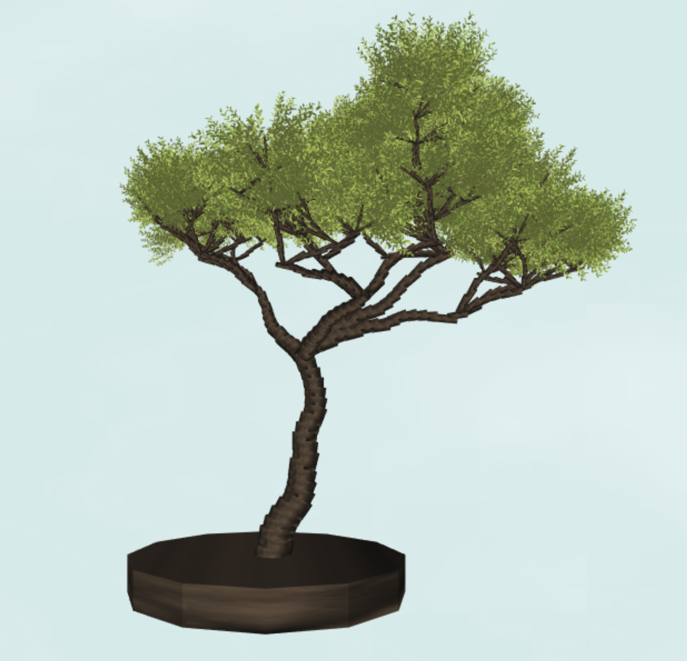

# Acacia Tree - Hanyu Liu (liuhanyu)

## Inspiration

## Live Demo Link 

https://helenl9098.github.io/hw04-l-systems/

## Implementation Details

- __Geometry__: The building blocks of the tree is made up of cylinders and bushes of leaves, both of which are read in using an obj loader. 

- __L-System__: The L system has an axiom along with a set of grammar rules that determine its expansion. The L system expands its axiom using the given number of iterations and node data structure, to keep track of how the characters are linked. The L-System also has a stack of turtles for the branches and for the leaves while maintaining a current turtle that changes position and orientation as the tree grows. 

- __Tree Structure__: The structure of the tree is made from an L System, where the orientation of the resulting branches is determined by a random value. The number of branches is determined by the expansion of the L system, which factors in a probability value to determine whether the tree should split into 2, 3, 4, or 5 branches, with 4 branches being the most probable. The length of the branches and their angle/axis of rotation both vary depending on a set probability, with longer branches oriented at a wider angle being more probable. As the turtle of the L system advances, its forward vector is offset by a noise value, resulting in organic, curved branches. As the turtle moves forward, it also decreases in width, determined by the depth of the turtle. The tree is favored to grow up, so the forward vector’s y value will never be negative. 

- __Colors + Background__: The colors of the bark, leaves, and background are done procedurally in the GPU. The bark uses fbm noise to formulate a wooden texture. The cloudy background is created using multiple layers of fbm noise, shifting over time. The entire scene is lambert shaded. 

## Modifiable Features

- __Thickness__: Toggle the thickness of the branches of the tree! 

- __Leaves Angle__: Change the orientations of the leaves on top of the tree! (Their orientation will still be offset by noise) 

- __Seed__: Changing the seed of the tree will change the entire tree shape! Scroll through to generate some more variations!

## External Resources

- Leaves obj: https://www.cgtrader.com/items/200519/download-page

- https://workshop.chromeexperiments.com/examples/gui/#7--Events
